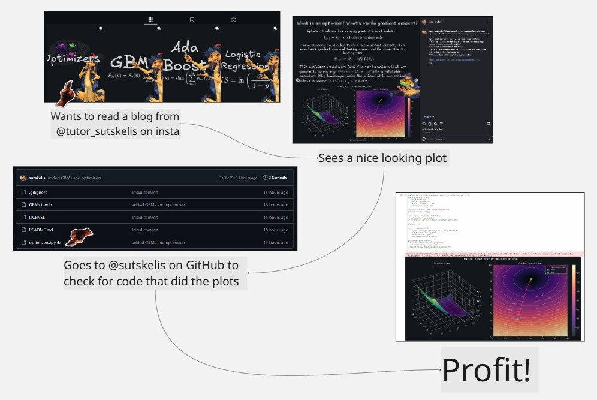

# sutskelis_explains_stuff
[@sutskelis](https://www.instagram.com/tutor_sutskelis/) explains ML stuff and shares related code here:

    
    

        
Let convexity be with you in these dark times...

    

